# ERD — Camping Ground Reservation System

## 1. Konsep Utama

Sistem mendukung:

- Multi property/camping ground
- Multi kota
- Multi staff per property
- Satu staff dapat ditugaskan ke lebih dari satu property
- Customer dapat melakukan self reservation
- Staff dapat membuat walk-in booking
- Owner dapat melihat seluruh property dan transaksi
- Harga weekday, weekend, long weekend, dan tanggal tertentu
- Check-in dan check-out
- Shift staff
- Pembayaran (Midtrans) dan laporan transaksi
- Staff dapat dinonaktifkan tanpa menghapus data
- Booking dapat terdiri dari beberapa unit sekaligus
- Promo code dengan kuota pemakaian
- Review/rating dari customer
- Waitlist FIFO jika fully booked
- Export laporan PDF/Excel
- Email notifikasi via Resend

---

# 2. ER Diagram

```mermaid
erDiagram

    USERS ||--o{ USER_ROLES : has
    ROLES ||--o{ USER_ROLES : assigned

    USERS ||--o{ REFRESH_TOKENS : has
    USERS ||--o{ STAFF_PROPERTY_ASSIGNMENTS : assigned
    PROPERTIES ||--o{ STAFF_PROPERTY_ASSIGNMENTS : has

    PROPERTIES ||--o{ PROPERTY_IMAGES : has
    PROPERTIES ||--o{ PROPERTY_FACILITIES : has
    FACILITIES ||--o{ PROPERTY_FACILITIES : used

    PROPERTIES ||--o{ UNIT_TYPES : has
    UNIT_TYPES ||--o{ UNITS : contains
    UNIT_TYPES ||--o{ UNIT_TYPE_IMAGES : has
    UNIT_TYPES ||--o{ UNIT_TYPE_FACILITIES : has
    FACILITIES ||--o{ UNIT_TYPE_FACILITIES : used

    UNIT_TYPES ||--o{ SPECIAL_RATE_PERIODS : has

    USERS ||--o{ BOOKINGS : customer
    PROPERTIES ||--o{ BOOKINGS : receives
    BOOKINGS ||--o{ BOOKING_ITEMS : contains

    UNIT_TYPES ||--o{ BOOKING_ITEMS : booked
    BOOKING_ITEMS ||--o{ BOOKING_ITEM_NIGHTS : priced
    BOOKING_ITEMS ||--o{ BOOKING_ITEM_UNITS : allocated
    UNITS ||--o{ BOOKING_ITEM_UNITS : assigned

    BOOKINGS ||--o{ PAYMENTS : paid_with

    USERS ||--o{ STAFF_SHIFTS : works
    PROPERTIES ||--o{ STAFF_SHIFTS : has

    STAFF_SHIFTS ||--o{ PAYMENTS : receives

    BOOKINGS ||--o{ WAITLIST_ENTRIES : has_waitlist
    BOOKINGS ||--o{ REVIEWS : reviewed

    PROPERTIES ||--o{ PROMOS : has_promos
    PROMOS ||--o{ PROMO_USAGE_LOGS : used

    USERS {
        uuid id PK
        varchar name
        varchar email UK
        varchar phone
        varchar password_hash
        enum status
        timestamp email_verified_at
        timestamp last_login_at
        timestamp created_at
        timestamp updated_at
    }

    ROLES {
        uuid id PK
        varchar code UK
        varchar name
    }

    USER_ROLES {
        uuid user_id FK
        uuid role_id FK
    }

    REFRESH_TOKENS {
        uuid id PK
        uuid user_id FK
        varchar token UK
        varchar device_info
        boolean is_revoked
        timestamp expires_at
        timestamp created_at
    }

    STAFF_PROPERTY_ASSIGNMENTS {
        uuid id PK
        uuid user_id FK
        uuid property_id FK
        boolean is_active
        timestamp assigned_at
        timestamp deactivated_at
    }

    PROPERTIES {
        uuid id PK
        varchar code UK
        varchar name
        varchar slug UK
        text description
        varchar city
        varchar province
        text address
        decimal latitude
        decimal longitude
        varchar timezone
        time check_in_time
        time check_out_time
        enum status
        timestamp created_at
        timestamp updated_at
    }

    PROPERTY_IMAGES {
        uuid id PK
        uuid property_id FK
        varchar url
        varchar original_filename
        integer sort_order
        boolean is_primary
        timestamp created_at
    }

    FACILITIES {
        uuid id PK
        varchar name
        varchar icon
        enum status
        timestamp created_at
    }

    PROPERTY_FACILITIES {
        uuid property_id FK
        uuid facility_id FK
    }

    UNIT_TYPES {
        uuid id PK
        uuid property_id FK
        varchar name
        varchar slug
        text description
        integer capacity
        integer total_units
        bigint weekday_price
        bigint weekend_price
        enum status
        timestamp created_at
        timestamp updated_at
    }

    UNITS {
        uuid id PK
        uuid unit_type_id FK
        varchar code
        varchar name
        enum status
        text notes
        timestamp created_at
        timestamp updated_at
    }

    UNIT_TYPE_IMAGES {
        uuid id PK
        uuid unit_type_id FK
        varchar url
        varchar original_filename
        integer sort_order
        boolean is_primary
        timestamp created_at
    }

    UNIT_TYPE_FACILITIES {
        uuid unit_type_id FK
        uuid facility_id FK
    }

    SPECIAL_RATE_PERIODS {
        uuid id PK
        uuid unit_type_id FK
        varchar name
        date start_date
        date end_date
        bigint price
        integer priority
        boolean is_active
        timestamp created_at
    }

    BOOKINGS {
        uuid id PK
        varchar booking_code UK
        uuid property_id FK
        uuid customer_user_id FK
        uuid created_by_user_id FK
        uuid shift_id FK
        uuid promo_id FK

        enum source
        enum status

        varchar guest_name
        varchar guest_email
        varchar guest_phone

        date check_in_date
        date check_out_date

        integer adults
        integer children

        bigint subtotal
        bigint discount
        bigint additional_fee
        bigint grand_total

        timestamp checked_in_at
        uuid checked_in_by FK

        timestamp checked_out_at
        uuid checked_out_by FK

        timestamp cancelled_at
        uuid cancelled_by FK
        text cancel_reason

        timestamp expires_at
        boolean is_expired

        text notes

        timestamp created_at
        timestamp updated_at
    }

    BOOKING_ITEMS {
        uuid id PK
        uuid booking_id FK
        uuid unit_type_id FK
        varchar unit_type_name_snapshot
        integer quantity
        bigint subtotal
        timestamp created_at
    }

    BOOKING_ITEM_NIGHTS {
        uuid id PK
        uuid booking_item_id FK
        date stay_date
        bigint unit_price
        integer quantity
        bigint total
        varchar rate_name
        timestamp created_at
    }

    BOOKING_ITEM_UNITS {
        uuid id PK
        uuid booking_item_id FK
        uuid unit_id FK
        timestamp allocated_at
        uuid allocated_by FK
    }

    PAYMENTS {
        uuid id PK
        uuid booking_id FK
        uuid shift_id FK
        enum method
        enum status
        varchar provider
        varchar external_order_id
        varchar external_reference
        varchar payment_url
        bigint amount
        bigint refund_amount
        uuid received_by_user_id FK
        timestamp paid_at
        text notes
        jsonb provider_response
        timestamp created_at
        timestamp updated_at
    }

    STAFF_SHIFTS {
        uuid id PK
        uuid property_id FK
        uuid user_id FK
        timestamp opened_at
        timestamp closed_at
        bigint opening_cash
        bigint expected_closing_cash
        bigint actual_closing_cash
        bigint total_cash_sales
        bigint total_transfer_sales
        bigint total_qris_sales
        enum status
        text notes
        timestamp created_at
    }

    WAITLIST_ENTRIES {
        uuid id PK
        uuid user_id FK
        uuid property_id FK
        date check_in_date
        date check_out_date
        integer adults
        integer children
        varchar unit_type_id FK
        integer priority_queue
        enum status
        timestamp notified_at
        timestamp expires_at
        timestamp created_at
    }

    REVIEWS {
        uuid id PK
        uuid booking_id FK
        uuid user_id FK
        uuid property_id FK
        integer rating
        text comment
        enum status
        timestamp created_at
    }

    PROMOS {
        uuid id PK
        varchar code UK
        varchar name
        text description
        enum discount_type
        bigint discount_value
        bigint min_booking_amount
        integer max_uses
        integer current_uses
        timestamp start_at
        timestamp expires_at
        boolean is_active
        timestamp created_at
        timestamp updated_at
    }

    PROMO_USAGE_LOGS {
        uuid id PK
        uuid promo_id FK
        uuid booking_id FK
        uuid user_id FK
        bigint discount_applied
        timestamp used_at
    }
```



---

# 3. Users dan Authentication

## users

Semua akun disimpan dalam tabel yang sama.

Status:

```text
ACTIVE
INACTIVE
SUSPENDED
```

Untuk menonaktifkan staff:

```text
users.status = INACTIVE
```

Data booking, transaksi, shift, dan aktivitas staff tetap tersimpan.

Jangan delete user yang sudah mempunyai aktivitas transaksi.

---

# 4. Refresh Tokens

Menyimpan refresh token per user/device:

```text
refresh_tokens
--------------------------------
id              | uuid
user_id         | FK → users
token           | varchar (unique)
device_info     | varchar (nullable)
is_revoked      | boolean
expires_at      | timestamp
created_at      | timestamp
```

Saat login:
- Buat access token (15 menit)
- Buat refresh token (7 hari)
- Simpan refresh token di DB

Saat refresh:
- Validasi refresh token di DB
- Kalau expired atau revoked → reject
- Buat access token baru
- Rotate refresh token (hapus lama, buat baru)

Saat logout:
- Revoke refresh token → `is_revoked = true`

---

# 5. Roles

Gunakan RBAC meskipun MVP mempunyai tiga role:

```text
OWNER
STAFF
CUSTOMER
```

Struktur:

```text
users
user_roles
roles
```

Di masa depan dapat ditambahkan:

```text
ADMIN
SUPERVISOR
FINANCE
MANAGER
```

tanpa mengubah struktur `users`.

---

# 6. Staff Assignment

Staff jangan langsung diberikan `property_id` pada tabel users.

Gunakan:

```text
staff_property_assignments
```

Contoh:

```text
Budi
├── Camping Ground Bogor
└── Camping Ground Bandung
```

Satu staff dapat membantu beberapa lokasi.

Owner tidak membutuhkan assignment karena secara default mempunyai akses seluruh property.

---

# 7. Property

`properties` merupakan cabang/lokasi camping ground.

Setiap property mempunyai:

- alamat, kota, provinsi
- koordinat GPS
- timezone
- jam check-in, jam check-out
- gambar
- fasilitas
- tipe unit
- staff

Status property:

```text
ACTIVE
INACTIVE
```

---

# 8. Unit Type

Unit type adalah jenis produk yang disewakan.

Contoh:

```text
Regular Camping Spot
Premium Camping Spot
Glamping Standard
Glamping Family
Cabin
Campervan Spot
```

Harga dasar di unit type:

```text
weekday_price  → bigint (Rp dalam integer, misal: 500000)
weekend_price  → bigint
```

---

# 9. Unit

`units` adalah inventory fisik.

Contoh:

```text
Glamping Family
├── GF-01
├── GF-02
├── GF-03
└── GF-04
```

Status unit:

```text
AVAILABLE    → unit boleh dijual
MAINTENANCE  → sedang diperbaiki
INACTIVE     → tidak aktif
```

Availability aktual dihitung dari booking pada tanggal yang diminta.
Jangan mengubah status unit menjadi `BOOKED` karena status booking bergantung pada tanggal.

---

# 10. Pricing

Harga normal:

```text
unit_types.weekday_price
unit_types.weekend_price
```

Untuk tanggal khusus:

```text
special_rate_periods
```

Jika ada beberapa special rate yang overlap, `priority` terbesar yang digunakan:

```text
Special Date / Holiday
        ↓
Weekend
        ↓
Weekday
```

---

# 11. Booking

Satu booking dapat memiliki beberapa unit.

Contoh:

```text
Booking #CG-260908-ABC1

2x Regular Camping Spot
1x Glamping Family
```

Maka:

```text
bookings
    ↓
booking_items
    ├── Regular Camping Spot x2
    └── Glamping Family x1
```

---

# 12. Booking Sources

```text
SELF_RESERVATION   → Customer melakukan reservasi melalui aplikasi
WALK_IN            → Staff membuat reservasi untuk guest datang langsung
ADMIN              → Owner/admin memasukkan booking manual
```

---

# 13. Booking Status

```text
PENDING
AWAITING_PAYMENT
CONFIRMED
CHECKED_IN
CHECKED_OUT
CANCELLED
EXPIRED
NO_SHOW
```

State normal:

```text
PENDING
   ↓
AWAITING_PAYMENT
   ↓
CONFIRMED
   ↓
CHECKED_IN
   ↓
CHECKED_OUT
```

Alternatif:

```text
AWAITING_PAYMENT → EXPIRED  (setelah 24 jam belum bayar)
CONFIRMED → CANCELLED      (dibatalkan oleh customer/staff/owner)
CONFIRMED → NO_SHOW        (melewati check-in_time + 2 jam, otomatis)
```

---

# 14. Price Snapshot

Harga booking jangan dihitung ulang menggunakan harga terbaru.

Gunakan `booking_item_nights` sebagai snapshot per malam:

```text
booking_item_nights
    stay_date   → tanggal menginap
    unit_price  → harga per malam saat booking dibuat
    rate_name   → nama rate yang berlaku (Weekday/Weekend/Natal/Lebaran)
    total       → unit_price × quantity
```

Jika harga kemudian berubah, transaksi lama tidak ikut berubah.

Ini penting untuk audit transaksi.

---

# 15. Availability

Availability dihitung berdasarkan:

```text
Total active units dengan status AVAILABLE
-
Unit yang sudah ter-booking pada periode tersebut
```

Overlap booking:

```text
existing.check_in_date < requested.check_out_date
AND
existing.check_out_date > requested.check_in_date
```

Booking status yang memblokir inventory:

```text
PENDING
AWAITING_PAYMENT
CONFIRMED
CHECKED_IN
```

Status berikut tidak memblokir:

```text
CANCELLED
EXPIRED
CHECKED_OUT
NO_SHOW
```

---

# 16. Unit Allocation

Ketika customer melakukan reservasi, tidak wajib langsung menentukan unit fisik.

Customer cukup memesan:

```text
2x Glamping Family
```

Sebelum check-in staff dapat menentukan:

```text
GF-01
GF-03
```

Assignment disimpan pada `booking_item_units`.

Ini lebih fleksibel daripada menentukan unit fisik sejak booking.

---

# 17. Payments

Satu booking dapat mempunyai lebih dari satu payment.

**Full payment wajib** — tidak ada sistem DP.

Metode:

```text
CASH            → dibayar tunai di lokasi (oleh staff)
BANK_TRANSFER   → transfer manual, staff konfirmasi
QRIS            → QR code dari Midtrans
PAYMENT_GATEWAY → Midtrans (credit card, VA, convenience store, dll)
OTHER           → metode lain
```

Status:

```text
PENDING
PAID
FAILED
CANCELLED
REFUNDED
```

Refund:

```text
payments.refund_amount   → jumlah yang direfund
payments.status = REFUNDED
```

Total paid:

```text
paidAmount = SUM(payments WHERE status = PAID)
remaining = booking.grand_total - paidAmount
```

---

# 18. Midtrans Integration

Gateway pembayaran: Midtrans (sandbox).

Konfigurasi:

```text
MIDTRANS_CLIENT_KEY   → client key
MIDTRANS_SERVER_KEY   → server key
MIDTRANS_IS_PRODUCTION → false (sandbox)
```

Endpoint:

```text
POST /api/v1/bookings/:bookingId/payment/create
     → membuat Midtrans transaction
     → return payment_url untuk redirect customer

POST /api/v1/payments/midtrans/notification
     → menerima webhook dari Midtrans
     → verifikasi signature
     → update payment status otomatis
```

Flow:

```text
Customer pilih bayar via Midtrans
    ↓
Backend buat Midtrans transaction
    ↓
Return payment_url
    ↓
Customer bayar di Midtrans page
    ↓
Midtrans kirim notification ke webhook
    ↓
Backend verifikasi + update payment status
```

---

# 19. Staff Shift

Staff harus membuka shift sebelum melakukan transaksi walk-in atau menerima pembayaran cash.

Contoh:

```text
Staff: Budi
Property: Camping Ground Bogor

Open:
08:00
Opening Cash: Rp500.000

Close:
17:00
Cash Payment: Rp3.000.000
Transfer Payment: Rp500.000
QRIS Payment: Rp200.000

Expected Closing Cash:
Rp3.500.000 (opening + cash sales)

Actual Closing Cash:
Rp3.480.000

Difference:
-Rp20.000
```

**Shift → Booking validation:** Shift harus di property yang sama dengan booking yang dibuat/dikelola staff.

---

# 20. Waitlist (FIFO)

Jika unit type fully booked untuk tanggal tertentu:

```text
Customer masuk waitlist
    ↓
Sistem simpan dengan priority_queue = MAX(priority_queue) + 1
    ↓
Ketika ada cancel/expire → cek waitlist
    ↓
Notifikasi customer pertama dalam antrian (FIFO)
    ↓
Customer punya waktu X jam untuk melakukan booking
    ↓
Jika tidak booking → status = EXPIRED, lanjut ke berikutnya
```

---

# 21. Promo Code

Struktur:

```text
promos
    code          → varchar (unique), misal: NEWYEAR2027
    name          → varchar
    description   → text
    discount_type → PERCENTAGE | FIXED
    discount_value → bigint (Rp atau %)
    min_booking_amount → bigint
    max_uses      → integer (0 = unlimited)
    current_uses  → integer
    start_at      → timestamp
    expires_at    → timestamp
    is_active     → boolean
```

Usage log:

```text
promo_usage_logs
    promo_id      → FK
    booking_id    → FK
    user_id       → FK
    discount_applied → bigint
    used_at       → timestamp
```

Validasi saat booking:

```text
1. Code exists && is_active = true
2. now() BETWEEN start_at AND expires_at
3. current_uses < max_uses (0 = skip check)
4. subtotal >= min_booking_amount
5. Satu user hanya bisa pakai satu promo per booking
```

Setelah booking terbuat:

```text
promo_usage_logs INSERT
promos.current_uses += 1 (dengan row lock)
```

---

# 22. Review

Customer dapat memberikan review setelah booking CHECKED_OUT.

```text
reviews
    booking_id → unique (satu booking = satu review)
    user_id    → FK
    property_id → FK
    rating     → integer 1-5
    comment    → text
    status     → APPROVED | HIDDEN
```

Validasi:

```text
1. booking.status = CHECKED_OUT
2. booking.customer_user_id = current user
3. Belum ada review untuk booking ini
```

---

# 23. Email Notifications

Provider: Resend

```text
RESEND_API_KEY → key dari resend.com
```

Email yang dikirim:

```text
1. Register verification → POST /api/v1/auth/register (customer)
2. Booking confirmation → setelah booking created (CONFIRMED)
3. Payment receipt → setelah payment PAID
4. Check-in reminder → H-1 sebelum check-in_date
5. Check-out reminder → pada check-out_date
6. Waitlist notified → saat slot tersedia
```

Email dikirim async (tidak blocking response).

---

# 24. Image Storage

Lokasi: local `/uploads`

Struktur:

```text
/uploads
    /properties/{propertyId}/
        {uuid}.jpg
    /unit-types/{unitTypeId}/
        {uuid}.jpg
```

Batas: max 5MB per file, format: JPG, PNG, WebP.

Thumbnail tidak di-generate di backend — front-end handle responsive image.

---

# 25. No-Show Auto Detection

Cron job berjalan setiap 1 jam.

```text
Cek bookings WHERE
    status = CONFIRMED
    AND check_in_date + check_in_time + 2 jam < NOW()

→ Set status = NO_SHOW
```

Atau bisa juga dilakukan saat staff query bookings (lazy check).

---

# 26. Export Reports

Endpoint owner:

```text
GET /api/v1/admin/reports/transactions?format=pdf
GET /api/v1/admin/reports/transactions?format=excel
GET /api/v1/admin/reports/occupancy?format=pdf
GET /api/v1/admin/reports/occupancy?format=excel
```

Library:

```text
PDF   → pdfkit atau @react-pdf/renderer (jika React-based)
Excel → exceljs
```

---

# 27. Index Database

```text
users(email)
users(phone)

refresh_tokens(token)
refresh_tokens(user_id)
refresh_tokens(expires_at)

properties(slug)
properties(city)

units(unit_type_id, status)

special_rate_periods(unit_type_id, start_date, end_date)

bookings(booking_code)
bookings(property_id, check_in_date, check_out_date)
bookings(customer_user_id)
bookings(status)
bookings(expires_at)

booking_items(booking_id)
booking_items(unit_type_id)

booking_item_nights(stay_date)
booking_item_nights(booking_item_id, stay_date)

payments(booking_id)
payments(status)
payments(paid_at)
payments(external_order_id)

staff_shifts(property_id, user_id)
staff_shifts(opened_at)
staff_shifts(status)

waitlist_entries(property_id, check_in_date, check_out_date)
waitlist_entries(status)

reviews(property_id)
reviews(booking_id)

promos(code)
promo_usage_logs(promo_id)
promo_usage_logs(user_id)
```

---

# 28. Database Recommendation

```text
PostgreSQL
```

Nominal uang menggunakan `BIGINT` (Rp dalam integer):

```text
Rp1.500.000
→ disimpan: 1500000
```

Jangan menggunakan `FLOAT` untuk nominal uang.
